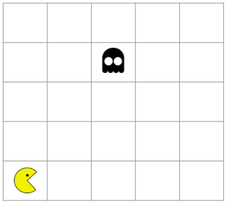
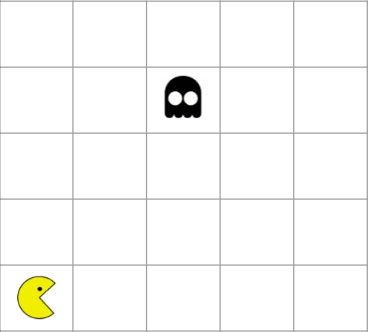

# WaveFront - Pacman Game
<h2>🎮 The Game</h2>
<h4>Pacman is an arcade game where there is a the main character(Pacman) and the ghosts. The game is based in run from the ghosts or, when its possible, eat them.</h4>

<h2>💻 The Algorithm</h2>
<ul>
    <li>
        <h4>🌊 Wavefront</h4>
        
The WaveFront algorithim was implemented based in a BFS Search algorithim and acts maping the field, with a initial position that is the ghost position.

        
It maps according to a 4-neighbourhood and the initial value is 0, that is the ghost position.

        

            <h3>Initial condition</h3>
            
            <h3>Wave Front</h3>
            
        

    </li>
    <li>
        <h4>😎 Pacman</h4>
        
Every before pacman makes a move is applied the wavefront to map the field. The pacman will move to the position that has the lower value mapped by the wavefront

    </li>
    <li>
        <h4>👾 Ghost</h4>
        
The ghost moves is random, with the following percentage:

        <ul>
            <li>20% -> Move to Right</li>
            <li>20% -> Move to Left</li>
            <li>20% -> Move Up</li>
            <li>20% -> Move Bottom</li>
            <li>20% -> Dont make a move</li>
        </ul>
    </li>
</ul>